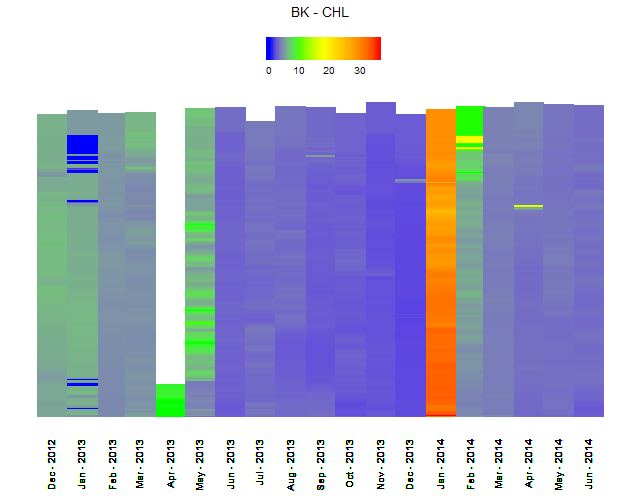

# Heat plots

## About  
R script using ggplot2 to generate water quality heatplots along monthly sampled transects.

## Data format

Input data should have:
- month (date format should be "01/01/2000")
- distance along transect
- variable for heatmap


## Example data format
| Date     | Reach | Distance | WQ_var1     | WQ_var2 | WQ_var3 |
|----------|-------|----------|-------------|---------|---------|
| 1/1/2000 | DD    | 100      | 0.258028461 | 1       | 1       |
| 1/1/2000 | DD    | 200      | 0.618948838 | 1.01    | 1.5     |
| 1/1/2000 | DD    | 300      | 0.334753042 | 1.02    | 2       |
| 1/1/2000 | DD    | 400      | 0.037936726 | 1.03    | 2.5     |
| 1/1/2000 | DD    | 500      | 0.033524366 | 1.04    | 3       |
| 1/1/2000 | DD    | 600      | 0.372026791 | 1.05    | 3.5     |
| 1/1/2000 | DD    | 700      | 0.523199757 | 1.06    | 4       |


## Images
Trying to match something like:


What this script produces:



## Usage

See ```heatmap_function_example.R``` for full example.


```
source(heatplot.R)

plot <- wq_heatplot(df, dateField, distanceField, wqVariable, title)

where:
df = R dataframe
dateField = name of the field in dataframe that holds the dates (M/D/YYYY)
distanceField = name of field that represents distance along transect
wqVariable = name of field with water quality data
title = text string to use as title of graph


```
