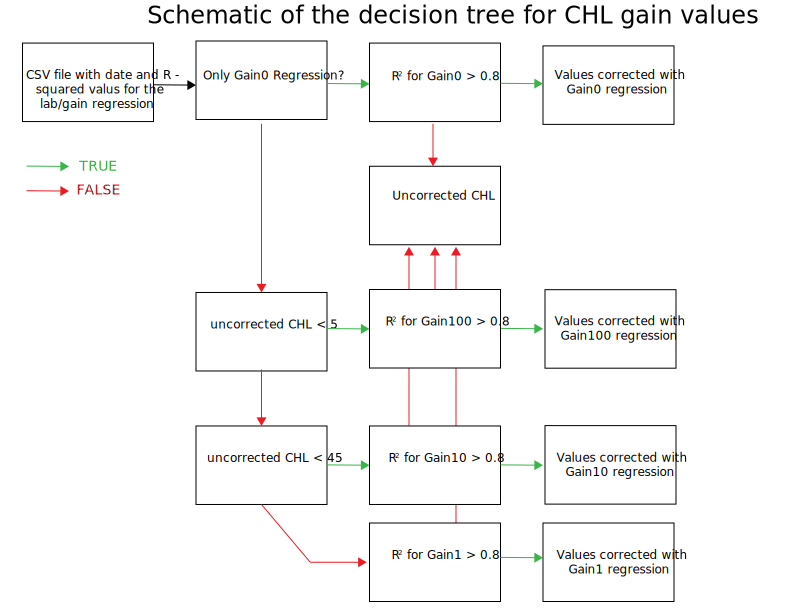

# Overview of correcting Chl from gain profiles and lab values

## Flowchart


## Overview

The water quality chlorophyll measurements collected during the transects get corrected in post-processing using the vertical gain profiles and the lab values. The vertical profiles are collected several times during a sampling day using different gain settings. Depths below the top 1m of the water column are discarded - the values for the top 1m are averaged for each of the profiles. For each gain setting, the daily average value for the site profile is compared to a grab sample that is processed back in the lab for chlorophyll content using a linear regression. This linear regression equation is then applied to the water quality transect data. The output is the water quality transect data with corrected values for each of the gain settings.

## Linear regression equation
```{r}

# linear model for chl values
# CHL2 = lab, CHL=vert gain profile
 chl_lm <- lm(joined_chl_df$CHL2~joined_chl_df$CHL)

coeff <- coefficients(chl_lm)
coeff_a <- unname(coeff[1])
coeff_b <- unname(coeff[2])
wq_transect[CHL_gain_corr]<- coeff_a + coeff_b*wq_transect$CHL

```

## Decision Tree

TODO: look at `4_Arc_FinalCHL_heatmap_prep.R` to figure out the details about the decision tree.

### pseudo code

```


if the measured chlorphyll value is less than 5:

  if gain100 r-squared values is less than 0.8:
    return the uncorrected CHL values
  else:
    return the gain100 corrected values

else:
  if measured chlophyll value is less than 45:
    if the gain1 rsquared value is less than 0.8:
      return the uncorrected CHL values
    else:
      return gain10 corrected values
  else:
    if gain10 rsquared values is less than 0.8:
      return the uncorrected CHL values
    else:
      return gain1 corrected values
```

### schematic

